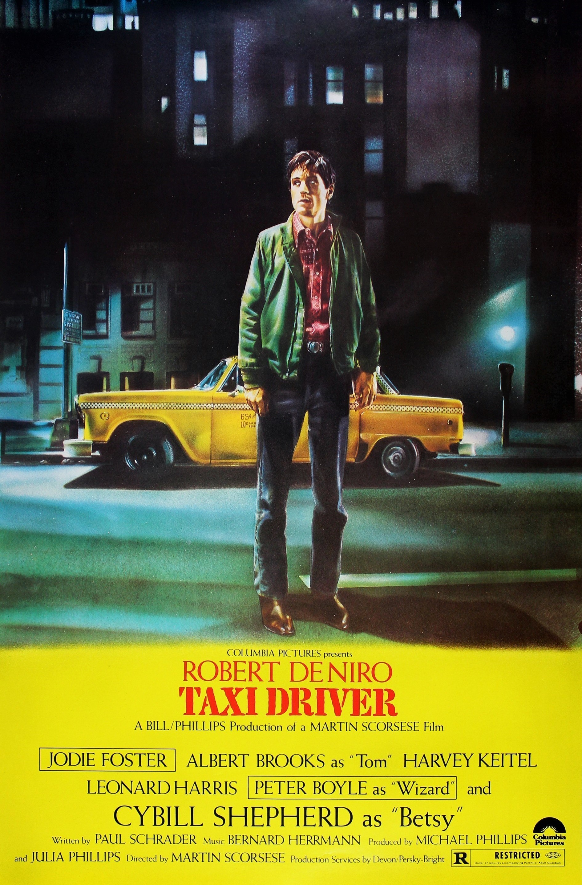

# Taxi Driver

--- 

Taxi Driver is a Martin Scorsese film that follows Travis Bickle,
a Vietnam War veteran suffering from insomnia and disillusionment
with society. Travis takes a job as a taxi driver in New York City,
where he witnesses the corruption, crime, and degradation of the
city's underbelly.

As Travis becomes increasingly disturbed by the world around him,
he becomes obsessed with a young woman named Betsy, who works for
a political campaign. After a failed attempt to impress her,
Travis begins to spiral into a violent and paranoid state, convinced
that he must take matters into his own hands to rid the city of its evils.