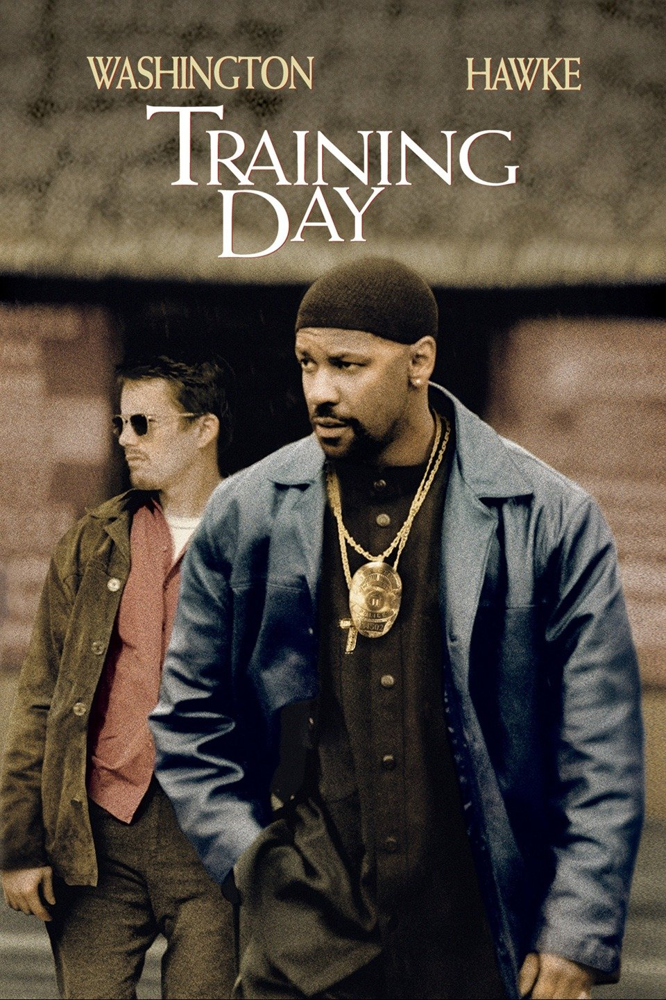

# Training Day

---

Training Day is a crime thriller directed by Antoine Fuqua
and starring Denzel Washington and Ethan Hawke. The film follows
a rookie police officer, Jake Hoyt, who is assigned to spend
a day with a veteran narcotics detective, Alonzo Harris,
as part of his training.

As the day progresses, Jake quickly learns that Alonzo operates
outside of the law and engages in corrupt and violent behavior.
Alonzo drags Jake into a dangerous world of drug dealing and
gang violence, forcing him to confront his own moral compass
and make difficult decisions.