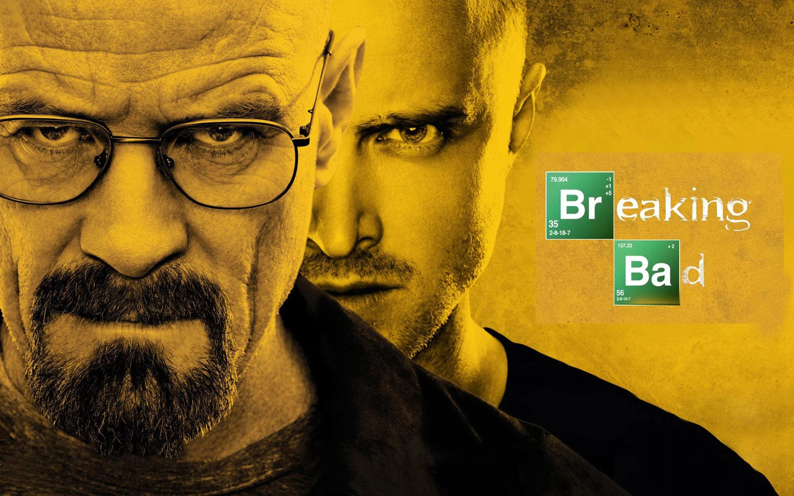

# Breaking Bad

---

"Breaking Bad" is a critically acclaimed television
series created by Vince Gilligan that aired on AMC.
The show follows the journey of Walter White (played
by Bryan Cranston), a high school chemistry teacher
who is diagnosed with terminal cancer and turns to
cooking and selling methamphetamine with his former
student, Jesse Pinkman (played by Aaron Paul), 
to provide for his family's future.

As Walter delves deeper into the world of drug dealing,
he begins to embrace his inner criminal, adopting the 
persona of "Heisenberg" and becoming increasingly 
ruthless and cunning. Along the way, he and Jesse encounter
a host of dangerous and unpredictable characters, including
rival drug dealers, corrupt law enforcement officials, 
and even family members.

Throughout the series, the tension and stakes escalate 
as Walter and Jesse's operation becomes more complex and
dangerous. The show is renowned for its complex characters,
intricate plotlines, and masterful cinematography. 
With its exploration of themes such as morality, power,
and human nature, "Breaking Bad" is widely regarded as 
one of the greatest television dramas of all time.