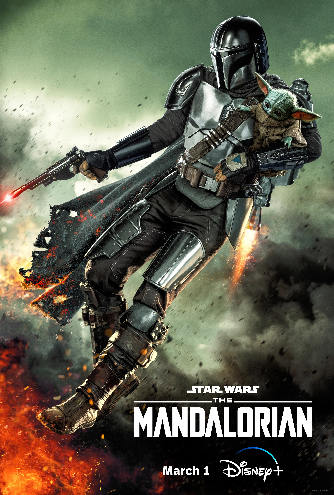

# The Mandalorian

---

"The Mandalorian" is a live-action television series set
in the Star Wars universe, created by Jon Favreau and
released on Disney+. The show follows the adventures of a
lone bounty hunter known as "the Mandalorian" (played by
Pedro Pascal), who is hired to track down and capture elusive
bounties across the galaxy.

In the first season, the Mandalorian accepts a job to capture
a valuable asset, which turns out to be a young child of the same
species as the iconic character Yoda. Despite the danger and
difficulties in protecting the child, the Mandalorian develops
a strong bond with it and ultimately decides to protect it from
those who seek to harm it.

In the second season, the Mandalorian continues his quest to find
the child's true home while encountering new allies and enemies
along the way. He also learns more about the child's mysterious
abilities and its significance to certain factions within the Star
Wars universe.

Throughout the series, the Mandalorian navigates a dangerous and 
lawless galaxy, facing challenges such as rival bounty hunters, 
imperial remnants, and ancient creatures.